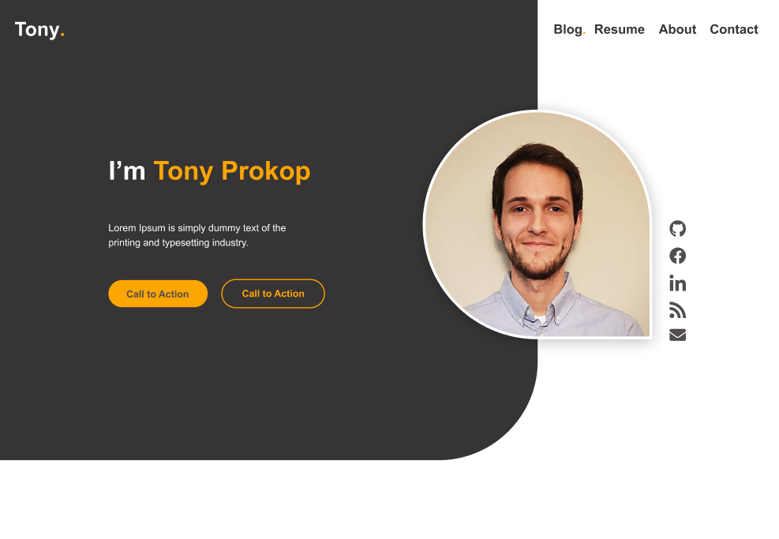
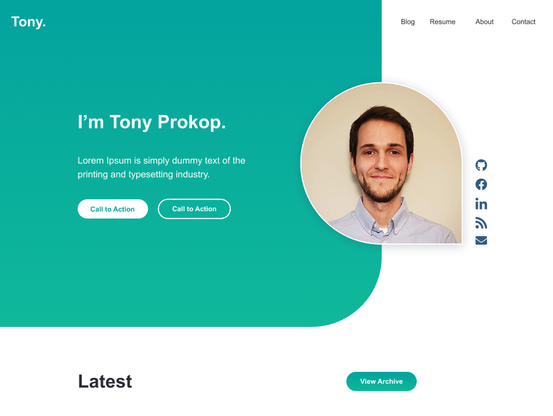

*You're reading my first blog post! Thanks. Stay tuned for more in the coming months.*

I've always wanted a personal website, but struggled when it came time to design it. I've always said I can tell when something looks bad, but don't know how to fix it. After a lot of iteration and research, I've settled on something I'm happy with and am more confident in my design skills as a result. Here's what I learned during the process.

## Purpose

Before opening Figma or thinking about colors and fonts, I defined what I'm trying to build. I want this site to accomplish the following four things:

- Improve online presence and personal brand
- Attract clients for freelance work
- Document my journey as a developer
- An additional asset in the job hunt

I need a mashup of a blog / portfolio / resume site. With this in mind, I went to the internet to find inspiration.

## Borrow. Borrow. Borrow.

I looked at countless Dribbble shots and top 25 blogs to get a feel for what I wanted my site to look like. I discovered that I have an affinity for minimal and mobile first design which, asside from being common design patterns today, have the added benefit of taking less time to build. Here are a few of the my favorites.

- [Zack Leatherman](https://www.zachleat.com/)
- [Gil Huybrecht](http://www.gilhuybrecht.com)
- [Dennis Nellenberg](https://www.dennissnellenberg.nl/en)

## Time to Design

After being inspired and having a clear picture of what I was trying to build, it was time to open Figma and work through the details.

### Color

Color is difficult. I tried many different palletes from the internet and was even briefly inspired by my [North Face Stormbreaker 3 Tent](https://www.rei.com/product/129203/the-north-face-stormbreak-3-tent). Nothing seemed to fit. I learned that color is coupled to the layout and features of a site and you can't take *any* color pallete expect it to fit. This was the pitfall I ran into, I was trying to iron out the colors too early in the process. I waited until the layout was more established, only then realizing that I don't need more than two colors. The design is so minimal that forcing more than two colors made it feel akward. I ended up with a base color black and a red accent color. The accent color is used to draw attention to areas of focus and interaction. Two colors keep it minimal, focused on content, and easy to implement.

### Font

I tried using just one font for performance reasons, but that's too boring. A common pattern is to use font to differentiate headings and body text. I'm using Merriweather for the headings and Arial for body text. Arial is a system font, which is great because it doesn't need to be loaded over the network. Using a system font in conjuction with a web font allows me to be performance focused, but not compromise design.

### Header

Instead of going down the rabbit hole of designing a logo, I opted to just have the text *"Tony."*. This is in the same font as the headings, and uses the accent color for the period. I feel this is as good as I can get without an actual logo, and establishes the brand / style / theme of the website in a concise way. As an aside, the favicon for the website follows a similar line of thinking. It is just the letter "T" followed by a period in the accent color.

There isn't anything too exciting going on with the menu, it uses the three bar icon everyone is used to. A common pattern is for the menu icon to transform into links on desktop, where there is more space. I opted to leave it an icon, which keeps the design simple and mobile first.

### Home Page

The home page follows extremely common design patterns, there is one statement in the center of the screen with the most important word of that statement highlighted in the accent color. At the bottom of the screen is a down arrow that scrolls the page, also in the accent color. Below the fold are links to my latest three posts, and one link the the archive.

At this point the rest of the design fell in place. I had established common themes that I could pull from to build the remaining pages. You'll notice the archive, resume, about, and contact pages are consistent in their placement of the heading. Elements like lists, paragraphs, and links all are consistent as well.

## Future Improvements

I'm always looking for ways to improve the site, here are some items at the top of my list:

- Case studies of my past work, a page for each project as well as a landing page for all projects
- More content on the home page, possibly a latest projects section
- Subtle background image for a home page banner
- Link styling consistency. Currently there are 3 types of links on the site, I'm thinking of ways to consolidate that.
- Transitions / Effects

Look for these additions in the future!

## Conclusion

I tried to keep this process as lightweight as possible. My goal was to end up with a great looking site, learn a bit about design in the process, and not take a year to build it. I think I've accomplished that.

## Bloopers

For your viewing pleasure, here are some shots of my first iterations of the site. I don't think these layouts are horrible, but they speak to the internal struggle I was having with color.

